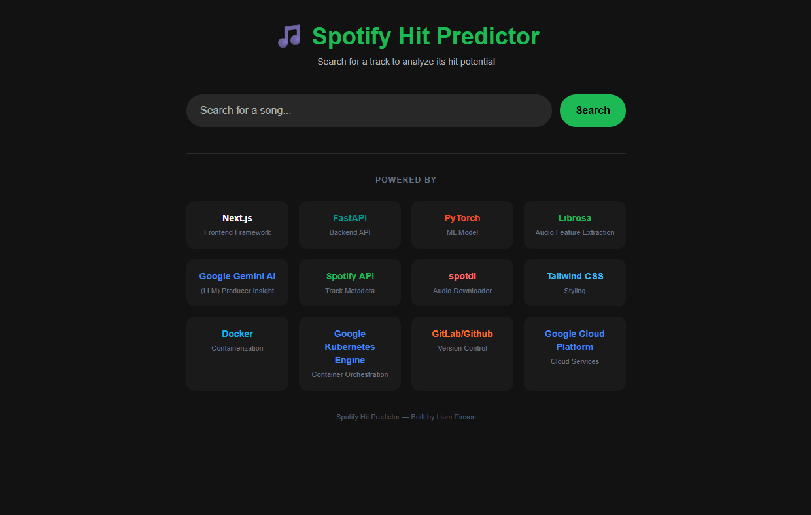
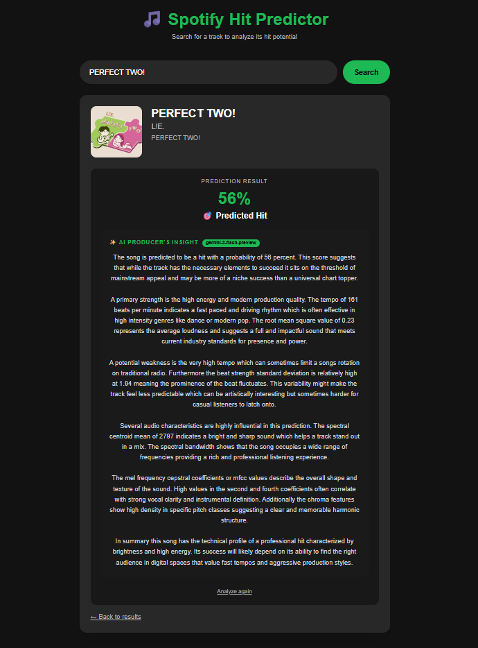
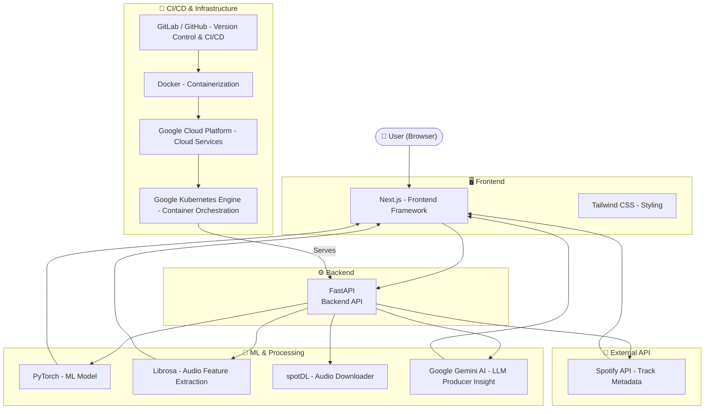

# 🎵 Spotify Hit Predictor


> An ML-powered web application that predicts whether a Spotify track has the potential to be a hit — using audio feature extraction, deep learning, and AI-generated producer insights.

---

## 🚀 Live App

👉 **[Try the App](http://34.173.196.151/)**

---

## 📸 Screenshots

### Home


### Prediction Result


---

## 🧠 Architecture



### System Design Overview

- **Frontend (Next.js + Tailwind CSS)** — Search UI and results display
- **Backend (FastAPI)** — API server orchestrating ML inference and data fetching
- **ML Layer (PyTorch + Librosa + spotDL)** — Audio download, feature extraction, and hit prediction
- **AI Insights (Google Gemini AI)** — LLM-generated producer insight per track
- **Spotify API** — Track metadata retrieval
- **CI/CD (GitLab / GitHub → Docker → GCP → GKE)** — Automated build, containerization, and deployment to Google Kubernetes Engine

---

## ✨ Features

- 🔍 Search any Spotify track by name
- 🎯 ML model predicts hit probability (%)
- 🤖 Google Gemini AI generates producer-style insights
- 🎧 Audio feature extraction (tempo, energy, MFCCs, spectral centroid, etc.)
- ☁️ Deployed on Google Cloud Platform via GKE

---

## 🛠 Tech Stack

| Layer | Technology |
|---|---|
| Frontend | Next.js, Tailwind CSS |
| Backend | FastAPI |
| ML Model | PyTorch |
| Audio Features | Librosa |
| Audio Download | spotDL |
| AI Insights | Google Gemini AI |
| Music Metadata | Spotify API |
| Containerization | Docker |
| Version Control / CI/CD | GitLab / GitHub |
| Cloud Services | Google Cloud Platform |
| Container Orchestration | Google Kubernetes Engine (GKE) |

---

## ⚙️ Local Setup

```bash
git clone https://github.com/YOUR_USERNAME/YOUR_REPO.git
cd YOUR_REPO
pip install -r requirements.txt
```

### Backend

```bash
cd backend
pip install -r requirements.txt
uvicorn main:app --reload
```

### Frontend

```bash
cd frontend
npm install
npm run dev
```

### Keys Needed:
You will need to obtain a Spotify Developer account and create an application to get your client ID and client secret.

You will also need to obtain a Google Gemini API Key.

These are free.


### Environment Variables - *FOR LOCAL DEVELOPMENT AND TESTING*

Create a `.env` file:

```
SPOTIPY_CLIENT_ID=your_client_id
SPOTIPY_CLIENT_SECRET=your_client_secret
SPOTIPY_REDIRECT_URI=http://127.0.0.1:8080/callback
SPOTIPY_USERNAME=your_spotify_username
GEMINI_API_KEY=your_gemini_key
SESSION_SECRET=change-this-to-a-long-random-string
```

Create file `.env.local` in spotify-frontend/  :
```
NEXT_PUBLIC_API_URL=http://localhost:8000
```

---

## 📚 Documentation

```bash
pip install mkdocs-material
mkdocs serve
```

---

## 📄 License

MIT — Built by Liam Pinson
