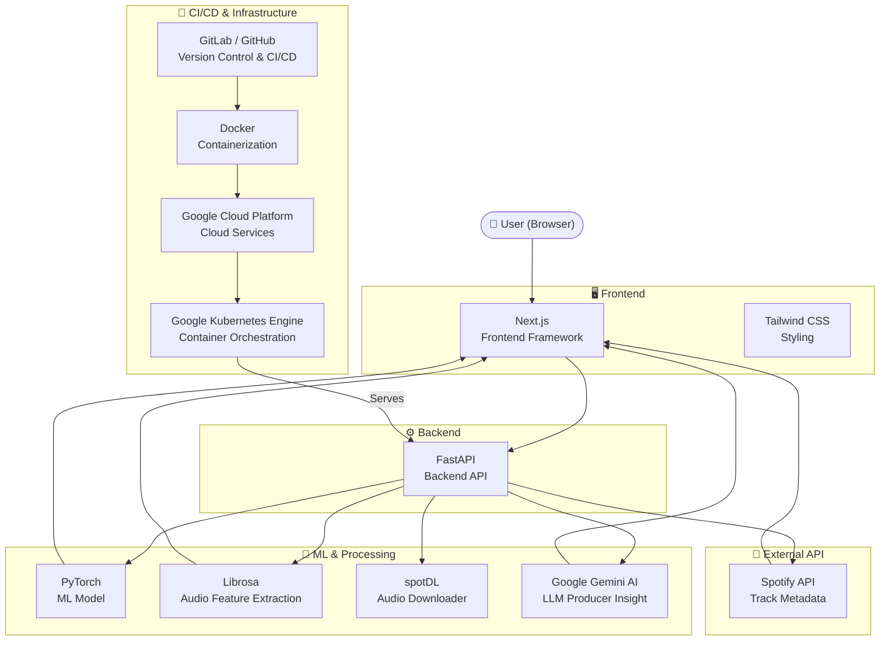

# Architecture

## System Architecture Diagram

## Layer Overview

| Layer | Technology | Role |
|---|---|---|
| Frontend | Next.js | UI & search interface |
| Frontend | Tailwind CSS | Styling |
| Backend | FastAPI | API server & orchestration |
| ML | PyTorch | Hit prediction model |
| ML | Librosa | Audio feature extraction |
| ML | spotDL | Audio downloading |
| AI | Google Gemini AI | LLM producer insights |
| External API | Spotify API | Track metadata |
| CI/CD | GitLab / GitHub | Version control & pipelines |
| DevOps | Docker | Containerization |
| Cloud | Google Cloud Platform | Cloud infrastructure |
| Orchestration | Google Kubernetes Engine | Container deployment |
